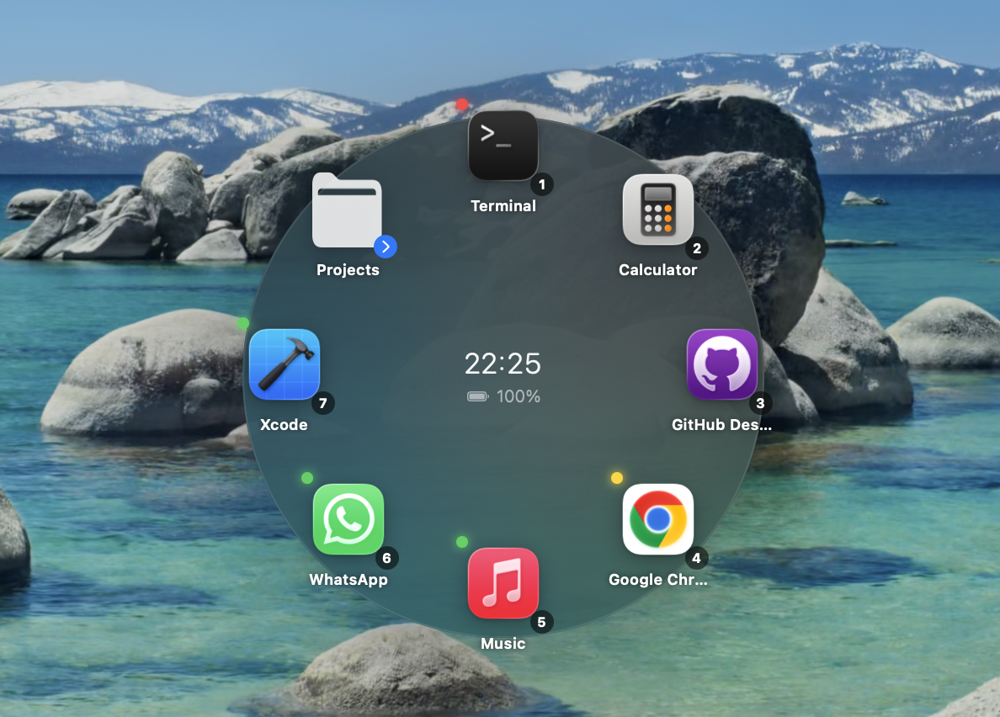

<p align="center">
  
</p>

<h1 align="center">Orbit</h1>

<p align="center">
  A radial launcher + system monitor for macOS.<br>
  Launch apps, switch windows, run scripts and track system vitals — all from a flick of your mouse.
</p>

<p align="center">
  
  
  
  
  
</p>

---

## What is Orbit?

Orbit lives in your menu bar and gives you two things:

| | |
|---|---|
| **Radial Launcher** | A circular menu that appears at your cursor. Open any app, file, link, or run a script — without moving your hands far from where you're already working. |
| **Window Switcher** | An instant window panel showing live previews of every open window. Click to jump to it, even if it's full-screen on another Space. |

---

## Features

### Radial Launcher
- Up to **12 items per page** arranged in a ring around your cursor, with smooth page-flip for more
- **Folders** — nested radials, one level deep, to group related items
- **Context sets** — automatically shows a different item set based on whichever app is in front
- **Clipboard ring** — last 10 copied texts always available inside the radial
- **Usage heat** — a colored dot (green → yellow → red) tracks how often you open each item today
- **Keyboard shortcuts** — press `1`–`9` to activate items without clicking, `←/→` to flip pages

### Window Switcher
- Shows all **open windows** across every Space and full-screen app
- **Live window previews** via ScreenCaptureKit — see exactly what's in each window before switching
- Clicking a window raises it precisely — even if it's full-screen in another Space
- Capped at **8 windows** to keep the panel clean and fast

### System Monitor
- Inline **CPU · GPU · Memory · Disk · Network · Temperature · Fan · Battery** readout in the menu bar
- Color-coded when metrics cross thresholds (optional)
- Configurable refresh interval and metric visibility
- Popover with detailed stats — click any metric badge to expand

### Triggers
| Action | Trigger |
|--------|---------|
| Open radial launcher | `⌘⇧D` or hold `⌥` + shake mouse |
| Open window switcher | `⌘⇧W` or hold `⌃` + shake mouse |
| Dismiss any panel | `Esc` or click outside |

### General
- **9 languages** — English, Turkish, Spanish, German, French, Chinese, Japanese, Russian, Korean
- **Custom menu bar icon** — choose any country flag emoji, or keep the default ◌ dot
- **Launch at login** via SMAppService (no login item hack)
- No network calls, no telemetry, no subscription

---

## Requirements

- macOS 13 Ventura or later
- Xcode 15 or later *(build from source only)*

---

## Install

### Option 1 — Download *(no Xcode needed)*

Go to [Releases](https://github.com/Mahmutakin99/Orbit/releases) and download the latest `Orbit.app.zip`.

Unzip and drag `Orbit.app` to your `/Applications` folder.

### Option 2 — Build from source

```bash
git clone https://github.com/Mahmutakin99/Orbit.git
cd Orbit
bash install.sh
```

`install.sh` builds a Release binary, signs it with your Apple Development certificate (so TCC permissions survive rebuilds), and copies it to `/Applications`.

---

## First Launch

1. Orbit's icon appears in the menu bar
2. Press `⌘⇧D` (or hold `⌥` and shake) to open the radial
3. Go to **Settings → Items** to add your first apps, files, or scripts
4. Grant **Accessibility** access when prompted — required for mouse-shake detection
5. Grant **Screen Recording** access if you want live window previews in the window switcher

---

## Settings

| Tab | What it does |
|-----|-------------|
| **Items** | Add, remove, reorder items. Click a folder icon to edit its children. Drag files from Finder. |
| **Context** | Define per-app item sets that appear automatically when that app is frontmost. |
| **General** | Keyboard shortcuts, shake trigger, sensitivity, language, launch at login, menu bar icon. |
| **Monitor** | Enable/disable metrics, set display order, configure units and refresh rate. |

---

## Permissions

| Permission | Why |
|-----------|-----|
| Accessibility | Required for global mouse-shake detection |
| Screen Recording | Optional — enables live window previews in the window switcher |

Orbit requests each permission the first time it needs it and never re-prompts after granting.

---

## Contributing

Pull requests are welcome. For large changes, open an issue first.

```bash
# 1. Fork and clone
git clone https://github.com/<you>/Orbit.git && cd Orbit

# 2. Create a branch
git checkout -b feature/my-feature

# 3. Build and test locally
bash install.sh

# 4. Commit and push
git commit -m "Add my feature"
git push origin feature/my-feature

# 5. Open a pull request on GitHub
```

---

## License

MIT © [Mahmut Akın](https://github.com/Mahmutakin99)
